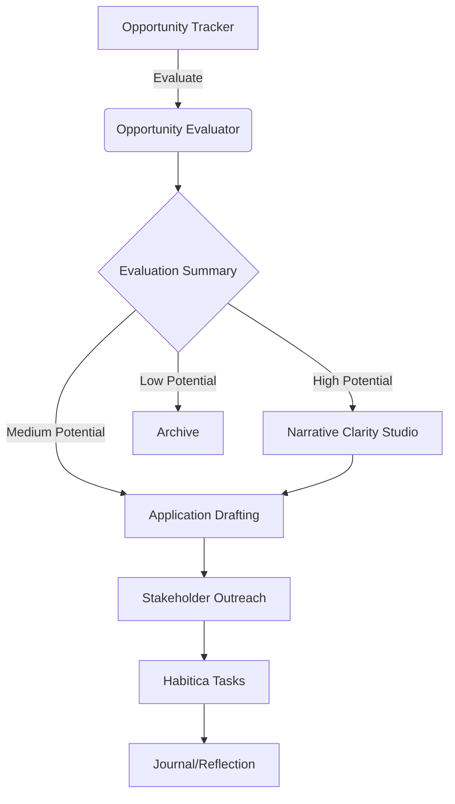

# Opportunity Engagement Super-Flow

## Overview

The Opportunity Engagement Super-Flow creates a guided, end-to-end experience when a new promising opportunity is identified and logged in the Opportunity Tracker. It integrates multiple Orion modules to provide a seamless workflow from opportunity identification to application, outreach, and reflection.

## Key Components

### 1. Enhanced Opportunity Detail View

The `EnhancedOpportunityDetailView` component serves as the central hub for the Opportunity Engagement Super-Flow. It provides:

- Comprehensive opportunity information
- Evaluation results with fit score and analysis
- Narrative alignment suggestions
- Application drafting tools
- Stakeholder outreach capabilities
- Task creation integration with Habitica
- Reflection prompts at key stages

### 2. Kanban Pipeline View

The `OpportunityKanbanView` component provides a visual representation of the opportunity pipeline, allowing for:

- Drag-and-drop status updates
- Visual workflow management
- Quick access to opportunity details
- Status-based organization

### 3. Status Workflow Automation

The Status Update system includes:

- Context-aware status transitions
- Automatic reflection prompts at key stages
- Status history tracking
- Visual status indicators

### 4. Narrative Alignment

The Narrative Alignment feature:

- Pulls relevant narrative points from memory
- Suggests key points to emphasize based on opportunity evaluation
- Provides copy-ready narrative summaries
- Helps tailor applications to specific opportunities

### 5. Integration Points

The Super-Flow integrates with:

- Opportunity Tracker
- Opportunity Evaluator
- Narrative Clarity Studio
- Application Drafting
- Stakeholder Outreach
- Habitica Task Management
- Journal/Reflection System

## Installation

To fully implement the Opportunity Engagement Super-Flow, you need to:

1. Install the required dependencies:
   ```bash
   npm install react-beautiful-dnd @types/react-beautiful-dnd
   ```

2. Ensure the database has the necessary tables:
   - `opportunities` - Main opportunity data
   - `opportunity_status_history` - Status change tracking
   - `opportunity_evaluations` - Evaluation results
   - `opportunity_drafts` - Application drafts
   - `opportunity_stakeholders` - Stakeholder contacts

## Usage

1. Navigate to the Opportunity Pipeline:
   - List View: `/admin/opportunity-pipeline`
   - Kanban View: `/admin/opportunity-pipeline/kanban`

2. View opportunity details:
   - Click on any opportunity card to access the Enhanced Detail View
   - Use the "Evaluate with Orion" button to assess fit
   - Generate application drafts with the "Draft Application" button
   - Find stakeholders with the "Find Stakeholders" button
   - Create tasks with the "Create Task" button
   - Add reflections with the "Add Reflection" button

3. Update opportunity status:
   - Use the "Update Status" dropdown in the detail view
   - Drag and drop cards in the Kanban view
   - Reflection prompts will appear at key status changes

## Architecture



## Future Enhancements

1. **Status Workflow Automation**:
   - Add more sophisticated status transitions based on time elapsed
   - Implement automatic reminders for follow-ups

2. **Deeper Narrative Integration**:
   - Enhance narrative alignment with more personalized suggestions
   - Add A/B testing for different narrative approaches

3. **Stakeholder CRM**:
   - Expand stakeholder tracking with more detailed contact information
   - Add communication history tracking

4. **Memory Integration**:
   - Improve how reflections and drafts are stored in memory
   - Create better retrieval mechanisms for past similar opportunities