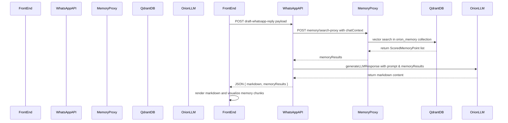

# Analysis of draft-whatsapp-reply API Route

## Incoming Payload
- `chatContext` (string[]): Chat history transcript for memory search and LLM context.
- `replyGoal` (string): Strategic goal for the drafted reply.
- `desiredTone` (string|null): Optional tone/persona for the reply.
- `decisionOptions` (string[]): Categories for multiple reply drafts.
- `userContext` (string|null): Additional context about the user’s current state.
- `numberOfDrafts` (number): Number of drafts per category.
- `relationshipType` (string|null): Nature of relationship for customizing tone.

## Memory Search Logic (lines 164–174)
- Calls `searchMemory(chatContext, { limit: 5 })` via `app/lib/memory`.
- On success, populates `memoryResults`.
- Logs warnings if no memories found or on errors; continues with empty `memoryResults`.

## Prompt Construction (lines 180–188)
- Invokes helper [`buildStrategicPrompt`](app/api/orion/communication/draft-whatsapp-reply/route.ts:22) with userName, replyGoal, desiredTone, decisionOptions, userContext, numberOfDrafts, relationshipType.
- Helper composes:
  - Markdown formatting instructions.
  - Primary directive and incoming data sections.
  - Detailed deep analysis steps and output format.

## LLM Call (lines 191–204)
- Calls `generateLLMResponse('whatsapp_reply_draft', chatContext, null, {...})`.
- Passes `memoryResults` and `systemContext` (full prompt).
- Includes legacy parameters (`replyGoal`, `tone`, `numberOfDrafts`) for compatibility.

## Response Shape (lines 220–225)
- Success response:
  ```json
  {
    "success": true,
    "markdown": "<LLM-generated markdown response>",
    "memoryResults": [ScoredMemoryPoint...]
  }
  ```
- Failure responses:
  - 400 Bad Request for missing payload with `{ success: false, error: string }`.
  - 500 Internal Server Error for LLM failures with `{ success: false, error: string }`.

## searchMemory Integration

- Client call uses `searchMemory(chatContext, { limit: 5 })` in the draft endpoint.
- The helper in `app/lib/memory.ts` POSTs to `/api/orion/memory/search-proxy` with:
## LLM Configuration

- Endpoint uses `generateLLMResponse('whatsapp_reply_draft', chatContext, null, options)`
- `requestType` is the literal string `whatsapp_reply_draft`, not one of the predefined `REQUEST_TYPES` constants.
- Model selection via `callLLMWithFallback` → `selectPrimaryModelForRequestType('whatsapp_reply_draft', healthyModels)`.
- No explicit override exists for `whatsapp_reply_draft`, so fallback order applies:
  1. Preferred model override from LLM settings (if configured)
  2. Global default model override (if configured)
  3. Hardcoded fallback for CV tailoring (skipped)
  4. General fallback model `groq/llama3-70b-8192`
  5. First available healthy model
- Retry and fallback logic ensure resilient calls across providers.
  - `queryText`: chatContext
  - `limit`: 5 (default)
## Front-end Payload Mapping

The UI component `WhatsAppReplyDrafter.tsx` assembles these state fields into the request payload:

- `chatTranscript` → `chatContext`
- `replyGoal` → `replyGoal` (defaults to placeholder if empty)
- `desiredTone` → `desiredTone` (null if unset)
- `selectedReplyTypes` (or full `decisionOptions` if none selected) → `decisionOptions`
- `userContext` → `userContext`
- `numberOfDrafts` → `numberOfDrafts`
- `relationshipType` → `relationshipType`

The payload is JSON-serialized and sent via POST to `/api/orion/communication/draft-whatsapp-reply`.
  - `withVectors`: false
  - No filter applied
- The backend API route and proxy assemble the Qdrant search using the collection name defined by `ORION_MEMORY_COLLECTION_NAME` (`orion_memory`).
- Response shape: `{ success: boolean; results?: ScoredMemoryPoint[]; error?: string }`

## Sequence Diagram



## Summary of Business Logic

- **Module Goal:** Generate hyper-personalized, strategic WhatsApp reply drafts that align with user objectives, tone preferences, and relationship context.
- **Core Utility:** Combines real-time chat history with historical memory data to architect responses that are proactive, advantageous, and visually structured in markdown.
- **Memory Integration:** Proxies `searchMemory` calls to Qdrant’s `orion_memory` collection with a limit of 5 embeddings. Retrieved `ScoredMemoryPoint`s enrich prompt context for deeper relevance.
- **Dynamic Prompt Construction:** Utilizes `buildStrategicPrompt` to produce a comprehensive system instruction covering analysis steps, reply categories, and formatting guidelines.
- **LLM Interaction:** Sends constructed messages to `generateLLMResponse` under request type `whatsapp_reply_draft`, leveraging retry and fallback model selection for resilience.
- **Response Handling:** Returns structured JSON containing markdown output and memory results. UI renders analysis, reply drafts, and memory visuals, and provides save-to-memory functionality.
