# Orion Project: Interconnected File Map (High-Level)

## GOAL OF FILE

Document the interconnectedness of core files, utilities, feature components, and shared packages in the Orion codebase. This map is intended to clarify dependencies, guide refactoring, and support rapid debugging and onboarding.

---

## Mermaid Diagram: High-Level File Interconnections

```mermaid
graph TD
  %% Core Utilities
  subgraph "src/lib/"
    L1[logger.ts]
    L2[database.ts]
    L3[notion_service.ts]
    L4[persona_service.ts]
    L5[orion_llm.ts]
    L6[memory.ts]
    L7[cv.ts]
    L8[profile_service.ts]
    L9[constants.ts]
    L10[utils.ts]
  end

  %% Shared Types
  subgraph "src/types/"
    T1[orion.ts]
    T2[types.ts]
  end

  %% Shared Packages
  subgraph "packages/shared/"
    S1[auth.ts]
    S2[profile_service.ts]
    S3[lib/logger.ts]
    S4[lib/notion_service.ts.new]
    S5[types/index.ts]
  end

  %% Feature Components
  subgraph "components/builder/orion/"
    C1[JournalEntryForm.tsx]
    C2[JournalList.tsx]
    C3[CVTailoringStudio.tsx]
    C4[OpportunityList.tsx]
    C5[OpportunityEvaluator.tsx]
    C6[EmotionalLogForm.tsx]
    C7[HabiticaTaskList.tsx]
    C8[NotionCVComponentsList.tsx]
    C9[JournalEntryWithMemory.tsx]
    C10[OpportunityActions.tsx]
    C11[PastOpportunitiesSection.tsx]
    C12[application/DraftApplicationButton.tsx]
  end

  %% API Routes
  subgraph "app/app/api/orion/"
    A1[journal/list/route.ts]
    A2[notion/cv-components/route.ts]
    A3[profile/route.ts]
    A4[opportunities/route.ts]
    A5[memory/route.ts]
  end

  %% UI Components
  subgraph "src/components/ui/components/orion/"
    U1[DraftCommunicationForm.tsx]
    U2[WhatsAppChatUploader.tsx]
    U3[DedicatedAddToMemoryFormComponent.tsx]
    U4[opportunities/OpportunityActions.tsx]
    U5[opportunities/AddOpportunityForm.tsx]
    U6[opportunities/OpportunityDetailView.tsx]
    U7[opportunities/OpportunityEvaluator.tsx]
    U8[opportunities/NarrativeAlignmentSection.tsx]
  end

  %% Interconnections
  L1 --> C1
  L1 --> C2
  L1 --> C3
  L1 --> C4
  L1 --> C5
  L1 --> C6
  L1 --> C7
  L1 --> C8
  L1 --> C9
  L1 --> C10
  L1 --> C11
  L1 --> C12

  L2 --> C3
  L2 --> C4
  L2 --> C5

  L3 --> C8
  L3 --> C3
  L3 --> C4

  L4 --> C5
  L5 --> C3
  L6 --> C9
  L7 --> C3
  L8 --> C4

  T1 --> C1
  T1 --> C2
  T1 --> C3
  T1 --> C4
  T1 --> C5
  T1 --> C6
  T1 --> C7
  T1 --> C8
  T1 --> C9
  T1 --> C10
  T1 --> C11
  T1 --> C12

  L1 --> A1
  L2 --> A1
  L3 --> A2
  L8 --> A3
  L2 --> A4
  L6 --> A5
  T1 --> A1
  T1 --> A2
  T1 --> A3
  T1 --> A4
  T1 --> A5

  U1 --> L1
  U2 --> L1
  U3 --> L1
  U4 --> L1
  U5 --> L1
  U6 --> L1
  U7 --> L1
  U8 --> L1

  U4 --> C10
  U5 --> C4
  U6 --> C4
  U7 --> C5
  U8 --> C5

  S3 --> L1
  S4 --> L3
  S2 --> L8
  S5 --> T1

  C3 --> S3
  C4 --> S3
  C5 --> S3
  C8 --> S4

  A1 --> S3
  A2 --> S4
  A3 --> S2

  U1 --> S3
  U2 --> S3
  U3 --> S3

  U2 --> L6
  U2 --> T1

  C3 --> L7
  C3 --> T1

  C4 --> L2
  C4 --> T1
```



---

## Summary

- **Core utilities** in `src/lib/` are the backbone for all features and API routes.
- **Shared types** in `src/types/` are used everywhere for type safety and data contracts.
- **Feature components** in `components/builder/orion/` implement Orion's main user-facing features.
- **API routes** in `app/app/api/orion/` orchestrate backend logic, using both core utilities and shared types.
- **UI components** in `src/components/ui/components/orion/` and related folders provide the user interface, often wrapping or composing feature components.
- **Shared packages** in `packages/shared/` re-export core utilities/types for monorepo-wide usage.

---

## Next Steps

- Use this map to identify redundant code, opportunities for consolidation, and to guide onboarding or debugging.
- For a more granular map or a focus on a specific feature, request a breakdown of that area.
- Suggest improvements, refactoring, or further documentation as needed.

# 🌀 orion dev cycle: self-reinforcing circular workflow

> a circular, agent-agnostic system to debug, build, test, reflect, and branch across llms and dev tools (cursor, notion, terminal, streamlit, web).

---

## 1. 🌟 intent clarification

define the why. architect the purpose. commit to what matters.

**🧠 fill:**

- goal: `[what do i want to build or fix?]`
- why it matters: `[what is the core value or vision behind this?]`
- module or system affected: `[which orion subsystem?]`
- success state: `[how will i know it's working?]`

**💬 prompts to ask the llm:**

```txt
- what's the architectural intent behind [fill goal]?
- what's the fastest way to go from concept to working prototype?
- what assumptions do i need to surface before building [fill]?
- how does this goal relate to my core orion principles?
```

---

## 2. 🧠 llm collaboration / planning

gather insights from multiple agents. extract architecture plans.

**🔄 consult (choose 2–3):**

- [ ] chatgpt (gpt-4)
- [ ] claude 3
- [ ] gemini
- [ ] deepseek / qwen
- [ ] cursor's local assistant

**💬 model prompt:**

```txt
you are an ai systems strategist. i am building [fill goal] for orion.

please return:
- key steps and modules required
- edge cases to account for
- warning signs or bugs
- naming suggestions for state and components
- one test case i might forget
```

**📎 decision:**

- [ ] go forward with best agent plan
- [ ] merge suggestions from multiple models
- [ ] cycle again if unclear or low-quality output

---

## 3. 🛠 implementation in cursor (or editor)

build now. no delay. this is the architect's lab.

**🧠 clarify before code:**

- component name: `[fill here]`
- file path: `[src/components/orion/[fill].tsx]`
- state shape: `[what are we tracking?]`
- target api route: `[api/orion/[fill]]`

**💬 cursor/gpt coding prompt:**

```txt
build a typescript component called [fill] that:
- [explain functionality in 1–2 lines]
- uses state for [fill]
- fetches data from [fill]
- handles error and loading
```

**💬 extra prompts:**

```txt
- write a unit test for [fill component]
- what are 3 likely bugs in this component?
- simulate api responses and show data render
```

**💡 if building python logic (e.g. in orion_python_backend):**

```txt
write a fastapi route to [fill goal], with json input of [fill shape].
return: [fill output].
```

---

## 4. 🧪 debugging + testing

catch breakage. rewire logic. log test cases.

**🧠 identify:**

- symptom: `[what failed?]`
- location: `[file path]`
- trigger: `[what caused it?]`
- logs: `[copy the full error here if available]`

**💬 prompts to diagnose:**

```txt
- what causes this react error: [fill message]?
- how can i reproduce this in a test?
- where would i add debug logging for [fill logic]?
- is this a typing issue or state sync error?
```

**📁 save test to:** `/tests/[feature_name].test.ts`

---

## 5. 🪞 self-reflection (architect's log)

track what worked, what felt stuck, what's evolving in you.

**🧠 questions to ask:**

```txt
- what was most intuitive in this session?
- what confused me and why?
- what friction repeated from last build?
- what assumptions did i confirm or break?
```

**📁 save to:** `/journal/[today]-dev-reflection.md`
**tags:** `#flow`, `#blocker_[fill]`, `#pattern_[fill]`

---

## 6. 🌱 branch to next

use momentum. ask what's unlocked. loop again.

**💬 prompts to find the next branch:**

```txt
- what downstream system will need to change now?
- what's the smallest next improvement i can ship?
- what feature does this unlock?
- what test coverage is missing now?
- where could user friction still live in this flow?
```

**🧠 update todo or roadmap:**

- `/tasks/next.md`
- `/intents/[new_feature].md`

🔁 loop back to → intent clarification

---

## 🔄 summary cycle flow

```txt
[1] intent
   ↓
[2] llm collaboration
   ↓
[3] implement via cursor
   ↓
[4] debug + test
   ↓
[5] reflect + log
   ↓
[6] branch next
   ↺ back to 1
```

---

## 🧭 ascii decision tree

```txt
        +---------------------+
        |   intent clarified  |
        +---------------------+
                  |
          +---------------+
          |  multi-llm plan|
          +---------------+
                  |
         good plan? / \
                  /   \
        +--------+     +-----------+
        | implement     | retry or |
        | in cursor      | try new |
        |                |  model  |
        +--------+     +-----------+
                  |
            +-------------+
            | debug + test|
            +-------------+
                  |
            +-------------+
            |  reflect +   |
            |  extract log |
            +-------------+
                  |
            +-----------------+
            | identify next   |
            | feature/step    |
            +-----------------+
                  |
              ↻ LOOP BACK
```

---

## 🐞 Issue Log and Resolutions

This section documents critical issues encountered during development, their root causes, the steps taken for resolution, and relevant file modifications. This log supports rapid debugging, knowledge transfer, and continuous improvement.

### Issue 1: Module Resolution Error for `cn` Utility

- **Description:** The `pnpm run dev` command failed due to a `Cannot find module '@/lib/utils'` error within `app/src/components/ui/avatar.tsx`.
- **Root Cause:** The `avatar.tsx` component was attempting to import the `cn` utility using an incorrect absolute path alias (`@/lib/utils`), which was not resolving correctly in the monorepo context.
- **Resolution Steps:**
  1.  **Initial Attempt:** Modified `app/src/components/ui/avatar.tsx` to use a relative import path: `import { cn } from '../lib/utils';`.
  2.  **Correction:** Further refined the relative import path to `import { cn } from '../../lib/utils';` to correctly point to `app/src/lib/utils.ts` given the nested directory structure.
- **Files Modified:** `app/src/components/ui/avatar.tsx`
- **Outcome:** The immediate module resolution error for `cn` was resolved, allowing `pnpm run dev` to proceed past this initial hurdle.

### Issue 2: PostCSS Configuration Error - Missing `plugins` Key and `__esModule` Warning

- **Description:** After resolving the `cn` import, the development server compilation (`pnpm run dev`) failed with an error: "Your custom PostCSS configuration must export a `plugins` key." A warning about `__esModule` also appeared. This error specifically impacted `app/layout.tsx` related to `next/font`.
- **Root Cause:** Next.js expects `postcss.config.js` to export its configuration in a specific format. The file was initially using an ES module default export (`export default`) which was not fully compatible with how Next.js was interpreting the configuration, leading to the `plugins` key not being recognized and the `__esModule` warning.
- **Resolution Steps:**
  1.  **Attempted Fix (Incorrect):** Changed `postcss.config.js` to use `module.exports = { ... };` (CommonJS format), attempting to resolve the `plugins` key issue. This led to a `ReferenceError` in the subsequent step, indicating an environment mismatch.
- **Files Modified:** `postcss.config.js`
- **Outcome:** This change temporarily exacerbated the issue by introducing a new error, highlighting the sensitivity of module type in this environment.

### Issue 3: PostCSS Configuration Error - `ReferenceError: module is not defined`

- **Description:** Following the previous attempt to fix `postcss.config.js`, the `pnpm run dev` command resulted in a `ReferenceError: module is not defined` within `postcss.config.js` itself.
- **Root Cause:** The environment (likely Next.js's build system) was attempting to load `postcss.config.js` as an ECMAScript module (ESM), but the file contained CommonJS syntax (`module.exports`). This module type mismatch caused the `ReferenceError`.
- **Resolution Steps:**
  1.  **Attempted Fix (Incorrect):** Renamed `postcss.config.js` to `postcss.config.cjs` to explicitly force CommonJS interpretation. This did not resolve the issue and was reverted.
  2.  **Corrected Fix:** Reverted `postcss.config.js` to its original name and changed its content to use `export default { ... };` (ES module default export) to correctly provide the PostCSS plugins. This aligns with how Next.js expects the configuration in an ES module context.
- **Files Modified:** `postcss.config.js`
- **Outcome:** The `ReferenceError` was successfully resolved, and the Next.js development server started compiling without any `next/font` or PostCSS-related errors. This confirmed that Next.js expects an ES module default export for its `postcss.config.js` file.

---
